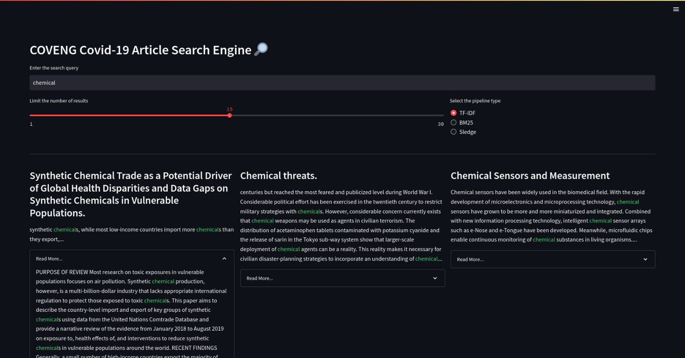
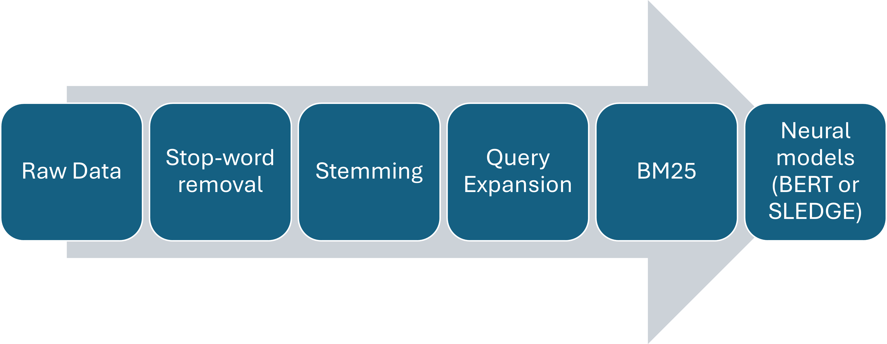

# COVENG: Efficient and Simple Way of Searching COVID-19 Articles

This is a project completed as part of the CENG596 - Information Retrieval course at METU. In this project, we aim to implement a search engine to efficiently search through a set of COVID-19-related articles from the medical field, while also providing a simple user interface to make this tool accessible to as many healthcare professionals and the general public alike as possible.

### Group Name: Stack Overflowers

* Can Ufuk Ertenli, ufuk.ertenli@metu.edu.tr 

* Onat Ozdemir, onat.ozdemir@metu.edu.tr

An example search from the UI can be seen below:



The overall data flow is presented below:



Supported models:
- TF-IDF
- BM25
- BERT
- SLEDGE (https://arxiv.org/abs/2010.05987)

## Installation \& Running

1. Create a conda virtual environment and activate it.

    ```shell
    conda create -n coveng python=3.8 -y
    conda activate coveng
    ```

2. Install PyTorch and torchvision following the [official instructions](https://pytorch.org/), e.g.,

    ```shell
    conda install pytorch torchvision -c pytorch
    ```

3. Install the requirements.

    ```shell
    pip install -r requirements.txt
    ```

4. Install OpenNIR.

	```shell
    pip install -q --upgrade git+https://github.com/Georgetown-IR-Lab/OpenNIR 
    ```

5. Run main.py for experimentation and coveng_search.py to trigger the search engine system launching a UI.


Note that JAVA_PATH environment variable must point to the local Java installation. 

The necessary settings can be controlled from the given config file. The best results can be obtained using SLEDGE with a full re-ranking approach with stemming, stop word removal, and query expansion.

| Method              | map                 | P(R=2)@10                | nDCG@10 | nDCG@100 |
|---------------------|---------------------|--------------------------|---------|----------|
| TF\_IDF             | 0.2579              | 0.6020                   | 0.6878  | 0.5408   |
| BM25                | 0.2426              | 0.5540                   | 0.6390  | 0.5084   |
| BERT(c=10)          | 0.0135              | 0.5500                   | 0.6307  | 0.1385   |
| BERT(c=100)         | 0.0752              | 0.4019                   | 0.4695  | 0.4775   |
| BERT                | 0.1294              | 0.0840                   | 0.0894  | 0.1697   |
| SLEDGE(c=10)        | 0.0142              | 0.5500                   | 0.6508  | 0.1429   |
| SLEDGE(c=100)       | 0.0943              | 0.6700                   | 0.7474  | 0.5296   |
| SLEDGE              | 0.2568              | 0.6359                   | 0.7228  | 0.5629   |

